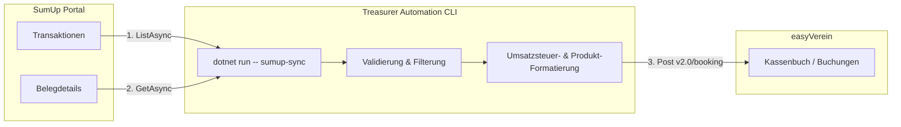

# Treasurer Automation CLI

Ein modulares CLI-Tool in .NET 10 zur Automatisierung von Buchhaltungsaufgaben für Vereine. Aktuell synchronisiert es Verkäufe (z. B. Getränkeverkäufe) von **SumUp** direkt als detaillierte Buchungen nach **easyVerein**.

## Datenfluss



## Setup & Konfiguration

Die Konfiguration kann entweder über **Umgebungsvariablen** oder direkt als **CLI-Optionen** (überschreibt Umgebungsvariablen) übergeben werden:

| Parameter | CLI-Option | Umgebungsvariable | Beschreibung |
| :--- | :--- | :--- | :--- |
| **SumUp Token** | `--sumup-token` | `SUMUP_ACCESS_TOKEN` | API-Zugriffsschlüssel für SumUp |
| **SumUp Merchant Code** | `--merchant-code` | `SUMUP_MERCHANT_CODE` | Deine Händler-ID bei SumUp |
| **easyVerein Token** | `--easyverein-token` | `EASYVEREIN_TOKEN` | API-Token (Bearer) für easyVerein – alternativ `dotnet run -- login` (Session) |
| **easyVerein Konto-ID** | `--billing-account` | `EASYVEREIN_BILLING_ACCOUNT_ID` | Interne ID des Kassen-/Bankkontos in easyVerein |

## Nutzung

Navigiere in das Projektverzeichnis:
```bash
cd TreasurerAutomation
```

### Hilfe anzeigen
```bash
dotnet run
# oder für spezifischen Befehl:
dotnet run -- sumup-sync --help
```

### Synchronisierung starten (Beispiel mit CLI-Parametern)
```bash
dotnet run -- sumup-sync \
  --sumup-token "DEIN_TOKEN" \
  --merchant-code "DEIN_CODE" \
  --easyverein-token "DEIN_EV_TOKEN" \
  --billing-account 12345 \
  --days 3 \
  --limit 50
```

*Zusätzliche Parameter für `sumup-sync`:*
- `--days <int>`: Zeitraum in Tagen in die Vergangenheit (Standard: `1`)
- `--limit <int>`: Maximale Anzahl der zu importierenden Transaktionen (Standard: `100`)

---

  1. **Neuer Befehl**: Erstelle eine Klasse in `Commands/` (z. B. `Commands/MemberAuditCommand.cs`), die von `AsyncCommand<TSettings>` erbt.
  2. **Registrieren**: Füge den Befehl in [`Program.cs`](TreasurerAutomation/Program.cs) hinzu:
     ```csharp
     config.AddCommand<MemberAuditCommand>("member-audit")
           .WithDescription("Auditiert Mitgliedsbeiträge.");
     ```

---

## easyVerein Verbindungstest (easyverein-test)

Es gibt einen integrierten Test-Befehl `easyverein-test` im Hauptprojekt, um den Beleg-Upload und die Buchungsverknüpfung in easyVerein unabhängig von SumUp vollautomatisch zu testen.

### Ausführung
Navigiere in den Hauptordner:
```bash
cd TreasurerAutomation
```

Starte den Test (das easyVerein-Token kann per Parameter oder Umgebungsvariable `EASYVEREIN_TOKEN` übergeben werden):
```bash
dotnet run -- easyverein-test --easyverein-token "DEIN_TOKEN"
```
*Dieser Befehl erstellt automatisch ein temporäres Test-Zahlungskonto, lädt einen 1x1 Dummy-PNG-Beleg hoch und verknüpft diesen mit einer Test-Buchung.*

---

## Zuwendungsbestätigung (spendenquittung)

Interaktiver Wizard, der eine Einzelbestätigung über Geldzuwendungen/Mitgliedsbeiträge nach `vorlagen/zuwendungsbestaetigung/vorlage.typ` ausfüllt und per `typst` als PDF erzeugt. Fragt Spender, Betrag (mit automatischer Zahlwort-Bestätigung, z.B. `eintausend Euro`), Daten, Verzicht, beide Unterschriften (Gesamtvertretung § 9 Abs. 2 Satzung) und Beleg-Nr. ab, validiert Pflichtfelder/Fristen und schreibt `spende-JJJJ-NNN-slug.typ` (+ `.pdf`) neben die Vorlage.

```bash
cd TreasurerAutomation
dotnet run -- spendenquittung
# Optionen: --vorlagen-dir <PFAD> --output-dir <PFAD> --skip-compile
```

### Tests

```bash
dotnet test
```

Das Testprojekt `TreasurerAutomation.Tests` (xUnit) prüft die Wizard-Logik ohne Interaktion: deutsche Zahlwörter (`GermanNumberToWords`), `.typ`-Erzeugung/Slug/Escaping (`SpendenquittungFileBuilder`) und Betrag-Parsing (`SpendenquittungCommand.ParseBetrag`, inkl. `1.000` vs. `1000.50`-Mehrdeutigkeit).

### easyVerein Lese-Probe (ev-probe)

Reine Lese-Probe (nur GET) gegen die easyVerein API – zeigt, welche Felder ein Endpunkt liefert. Vorbereitung für die Kassenprüfung.

```bash
cd TreasurerAutomation
dotnet run -- ev-probe --endpoint booking --query "limit=5"
dotnet run -- ev-probe --endpoint billing-account --query "limit=20"
dotnet run -- ev-probe --endpoint invoice --query "limit=5"
# Token per --easyverein-token oder EASYVEREIN_TOKEN
```

### Mitglieder-Audit (member-audit)

Read-only Prüfung aller Mitglieder per easyVerein-API (`v2.0/member`, nur GET) für den Beitragseinzug: Zustimmungen (SEPA-Einwilligung), Unterlagen (Nachweis ermäßigt), Stammdaten, Beitragsklasse (01=24€, 02=80€, 02.1=30€, 03=60€, 04=100€, 50% nach 30.06., Ehrenmitglieder 0€), SEPA-Readiness (IBAN/BIC/Mandat), Status/Mahnwesen (Satzung §5).

```bash
cd TreasurerAutomation
dotnet run -- member-audit --beitrag-jahr 2026 --format table
dotnet run -- member-audit --format csv --output audit-2026.csv
dotnet run -- member-audit --format json --output audit-2026.json --fail-on-blocker
# Einzelprüfung + Suche:
dotnet run -- member-audit --member 2        # ID oder Mitgliedsnummer
dotnet run -- member-audit --search "luca"   # mehrere Treffer -> interaktive Auswahl für Detail
# Hinweis: Details laden parallel (10x, je 3 Requests) mit 90/min-Limiter + Timing-Zeile; ~300 Requests brauchen mind. ~3 Min (API-Limit 100/min).
# Gruppen: VB01=24€, VB02=80€, VB2M=30€ (Familie Münsterlandkarte), VB03=60€, VB04=100€.
# Freiwilliger Zusatz (Feld 'Freiwilliger Beitrag'/VBF) steckt im Soll: Tabelle zeigt z.B. "84,00 € (+24,00)", CSV/JSON als eigene Spalte.
# Token: --easyverein-token > EASYVEREIN_TOKEN > login-Session
# Exit 2 bei --fail-on-blocker wenn Blocker gefunden (CI-fähig)
```

### Login / Session (get-token, refresh-token)

Interaktiver Login statt Token kopieren. Username wird automatisch als `$orgShort_$email` gebaut (z.B. `ats_luca.schoeneberg@artandtech.space`):

```bash
cd TreasurerAutomation
dotnet run -- login                          # fragt Username/Passwort, bei Bedarf 2FA
dotnet run -- login -u luca.schoeneberg@artandtech.space --org-short ats
dotnet run -- auth-status                    # Session prüfen
dotnet run -- auth-status --refresh          # Token per GET refresh-token auffrischen (nur wenn fällig)
dotnet run -- logout                         # Session löschen
```

* Token gilt 30 Tage, Refresh ab ~Tag 15 fällig (`tokenRefreshNeeded`-Header). `member-audit` erneuert Session-Token automatisch, sonst Hinweis.
* Priorität: `--easyverein-token` > `EASYVEREIN_TOKEN` > Session-Datei (`~/.config/treasurer-automation/easyverein-session.json`, 0600).
* Rate-Limit: 100/min (easyVerein). `member-audit` nutzt `limit` + `max-pages` + Server-Suche.
